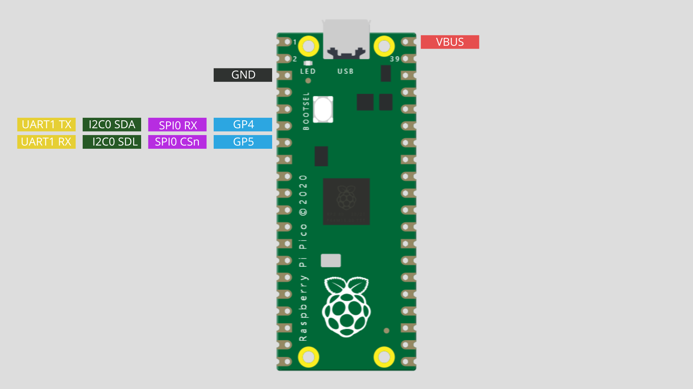
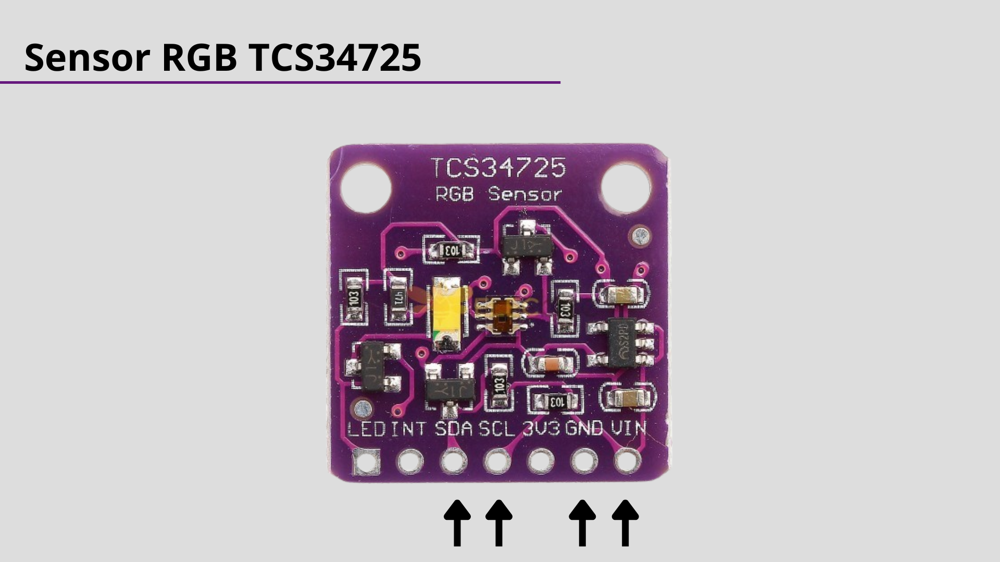
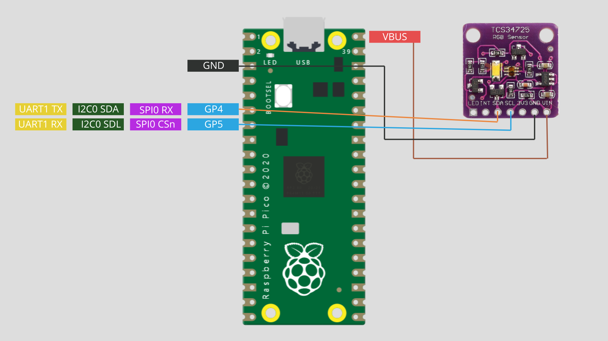

# Diagrama de Blocos: Comunicação I2C entre Raspberry Pi Pico e Sensor TCS34725

O diagrama de blocos abaixo ilustra a conexão e a comunicação I2C entre o Raspberry Pi Pico e o sensor de cor TCS34725. Ele apresenta os principais componentes e as conexões necessárias para a leitura das cores por meio do protocolo I2C.

## Descrição dos Componentes:

### Raspberry Pi Pico:
- Microcontrolador responsável por controlar o processo de leitura do sensor.
- Gerencia a comunicação I2C com o sensor TCS34725.

### Sensor TCS34725:
- Sensor de cor que mede as intensidades de luz nas faixas vermelha, verde e azul.
- Possui um endereço I2C específico para comunicação.

## Conexões:

### SDA (Serial Data):
- Conecta o pino SDA do Raspberry Pi Pico ao pino correspondente no sensor TCS34725.
- Canal de comunicação bidirecional para a transferência de dados.

### SCL (Serial Clock):
- Conecta o pino SCL do Raspberry Pi Pico ao pino correspondente no sensor TCS34725.
- Canal de comunicação unidirecional para sincronização de dados.

# Montagem
## Pinos da placa a serem utilizados

## Pinos do sensor a serem utilizados

## Funcionamento:

1. O Raspberry Pi Pico inicia a comunicação I2C com o sensor TCS34725.
2. A função `configure_sensor` é chamada para enviar comandos de configuração ao sensor.
3. O loop principal no arquivo `main.py` chama a função `escanear_cores` para realizar leituras periódicas das cores.
4. Os dados lidos são processados e normalizados.
5. As informações normalizadas são enviadas para o servidor Ubidots usando a função `POST` no arquivo `conexao.py`.

Este diagrama de blocos representa uma visão simplificada da comunicação I2C entre o Raspberry Pi Pico e o sensor TCS34725, fornecendo uma base para entender a interação entre os componentes no sistema.

# Descrição de comunicação I2C entre microcontrolador e sensor de comunicação serial

## Comunicação I2C entre Raspberry Pi Pico e Sensor TCS34725

A comunicação I2C (Inter-Integrated Circuit) é um protocolo serial utilizado para a comunicação entre microcontroladores e periféricos. No caso do Raspberry Pi Pico e do sensor TCS34725, a comunicação ocorre por meio de dois fios: SDA (Data) e SCL (Clock).

### Configuração do Sensor

Antes de iniciar a comunicação, é necessário configurar o sensor TCS34725. A função `configure_sensor` realiza essa configuração, enviando comandos e valores específicos para os registradores do sensor via I2C.

- **Endereço I2C do TCS34725:** 0x29
- **Controle do Sensor (Comando):** 0x80
- **Registro de Controle Automático Incremental:** 0xA0
- **Registros do Sensor:**
  - Registro de Habilitação (ENABLE): 0x00
  - Registro de Integração de Tempo (ATIME): 0x01

### Leitura das Cores

A função `escanear_cores` é responsável por realizar a leitura das cores do ambiente por meio do sensor TCS34725. Os valores lidos incluem a intensidade de luz clara (clear) e as intensidades de vermelho, verde e azul.

- **Registro de Dados (CDATAL, CDATAH, RDATAL, RDATAH, GDATAL, GDATAH, BDATAL, BDATAH):** 0x14 a 0x1B

Os dados lidos são então processados para obter valores proporcionais às intensidades das cores RGB (vermelho, verde, azul).

## Comunicação Serial entre Raspberry Pi Pico e PC

A comunicação serial é um meio de transferir dados em série entre dispositivos. No caso do Raspberry Pi Pico e do PC, essa comunicação é utilizada para enviar informações sobre as leituras de cores para um servidor MQTT hospedado na plataforma Ubidots.

### Configuração da Comunicação MQTT

O arquivo `conexao.py` contém funções para estabelecer a conexão Wi-Fi e publicar os dados no servidor MQTT da Ubidots. Aqui estão os principais pontos:

- **Cliente MQTT:** Utiliza a biblioteca `umqtt.simple` para criar um cliente MQTT.
- **Configuração:** Define o servidor, porta, chave da Ubidots e informações de Wi-Fi.
- **Conexão:** Estabelece a conexão Wi-Fi e, em seguida, a conexão MQTT.
- **Publicação:** Publica os dados no tópico especificado (`ROTA`) no formato JSON.

### Integração com o Sensor e Loop Principal

O arquivo `main.py` integra a leitura do sensor com a comunicação MQTT. No loop principal:

- As cores são lidas do sensor usando funções do arquivo `sensorConfig.py`.
- As intensidades de cada cor são normalizadas e convertidas para um código hexadecimal.
- Um JSON é construído com os dados normalizados de intensidade vermelha e enviado para o servidor Ubidots usando a função `POST` do arquivo `conexao.py`.

Essa integração permite monitorar e visualizar as leituras do sensor em tempo real na plataforma Ubidots, proporcionando uma solução completa de IoT utilizando o Raspberry Pi Pico.
